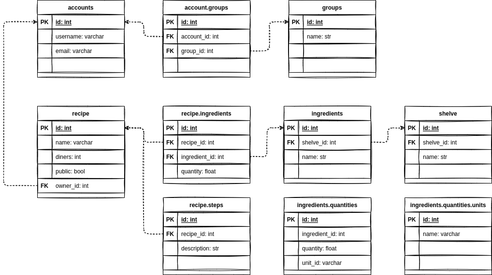

# FoodBro's concept

For more information regarding architecture or configuration of ShopEat, [have a look at documentation](https://sylvanld.github.io/shopeat/latest/).

## :bento: RECETTES

### :memo: CREER DES RECETTES

- Ingrédients quantifiés...
- ...scalables selon le nombre de portions 
- Etapes des préparation basées sur les quantités variables

### :book: CHERCHER DES RECETTES

- Recettes publiques
- Recettes de certaines personnes (e.g: mes amis)
- Par ingrédients...

## :shopping_cart: COURSES

Une session de courses permet de planifier et acheter à plusieurs. 
Il faut conserver le lien entre les ingrédients achetés et les recettes prévues.

### :clipboard: PLANNIFIER

- En sélectionnant des recettes on peut ajouter leurs ingrédients à la liste
- En ajoutant manuellement des ingrédients
- Possibilité de modifier les recettes au moment de les sélectionner...
- ...si souhaité, la nouvelle recette créée peut être forkée pour la réutiliser

### :ballot_box_with_check: ACHETER

- Trier les ingrédients par rayon
- Possibilité de checker (et annuler) des ingrédients
- Synchroniser la liste de courses entre les participants
- Possibilité de verrouiller un ingrédient avant de l'avoir trouvé pour indiquer aux autre de ne pas le chercher

### :credit_card: PAYER

**INCLURE UNE OPTION DE PARTAGE DES COUTS...**

## :hocho: CUISINER

- Chercher les plats prévus qui n'ont pas encore été faits
- Suivre une recette
- Marquer une recette comme fait (pour X personnes)

-----------------------------------------------------------

**Comment partager au mieux?**

- Les recettes et les ingrédients sont partageables publiquement
- Le planning des courses, la liste et la cuisine sont accessibles à un groupe.

Exemples de groupes:

- Famille
- Amis
- Collègues
- Etc...

# FoodBro's database

# FoodBro's architecture

